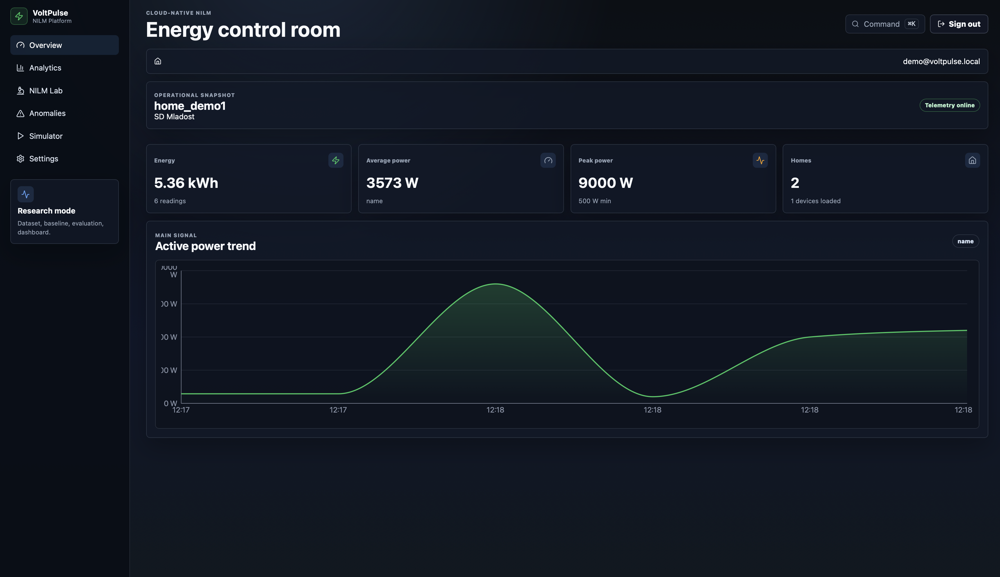
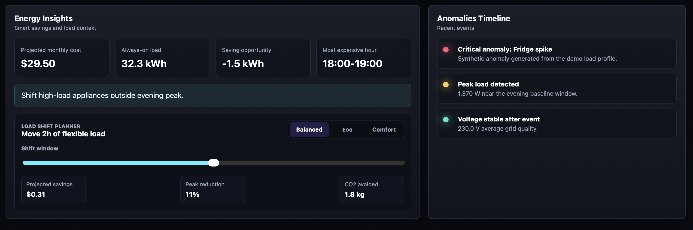
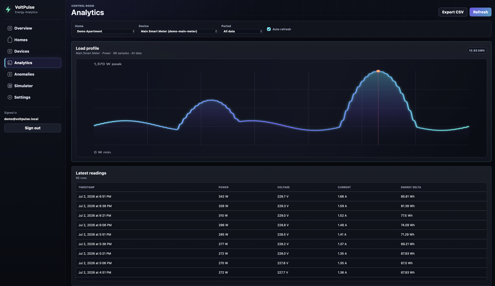
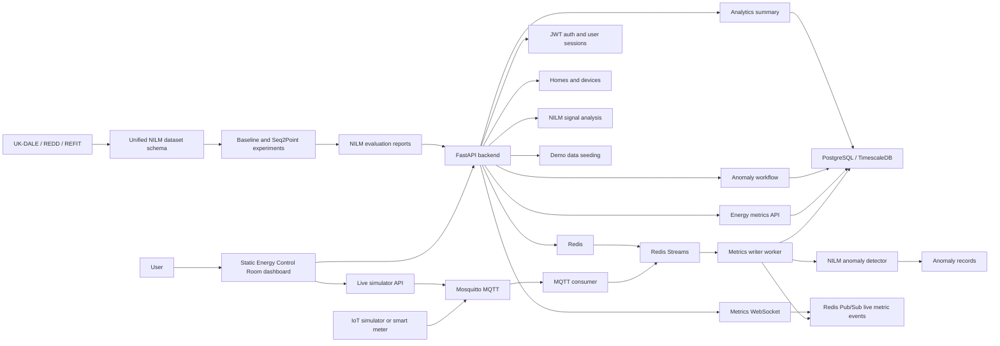

# VoltPulse Analytics

Premium NILM energy analytics platform for home electricity monitoring, smart
meter telemetry, anomaly detection, and appliance-level disaggregation research.

VoltPulse combines a FastAPI backend, PostgreSQL/TimescaleDB storage, Redis,
Mosquitto, Redis Streams ingestion, public NILM dataset tooling, demo data
generation, and a polished dark "Energy Control Room" dashboard for exploring
energy usage in a smart home.



## Product Snapshot

VoltPulse is built around one practical question:

> What is happening in the home energy system right now, and what should the
> user do next?

The dashboard turns raw meter readings into an operator-style view with:

- live energy KPIs and sparklines
- active power, voltage, current, and estimated cost chart modes
- Today vs Yesterday comparison overlay
- device activity cards with impact indicators
- anomaly timeline and triage workflow
- load shift planner with savings, peak reduction, and CO2 estimates
- MQTT to Redis Streams to TimescaleDB ingestion pipeline
- public dataset conversion for UK-DALE, REDD, and REFIT experiments
- baseline appliance-level disaggregation metrics
- NILM signal analysis for detecting load step events from meter readings
- automatic anomaly creation from fresh NILM load events
- WebSocket live metric updates for the dashboard chart and readings table
- demo simulator for generating local datasets and live MQTT readings

## Screenshots

### Energy Control Room

The hero screenshot at the top shows the intelligence strip, energy KPIs,
interactive chart, device activity, and selected device inspector.

### Energy Insights

The lower overview area highlights savings, always-on load, load shifting, and
recent anomaly context.



### Analytics

The analytics view keeps the same visual language while exposing the load
profile chart and latest readings table.



Optional screenshots to add later:

- Swagger API docs at `http://127.0.0.1:8000/docs`
- Simulator page after demo data seeding
- Anomaly triage page with acknowledge/resolve actions

## Architecture



## Tech Stack

| Area | Technology |
| --- | --- |
| Backend | FastAPI, SQLAlchemy async, Pydantic |
| Database | PostgreSQL with TimescaleDB image |
| Messaging/cache | Mosquitto, Redis |
| Auth | JWT access tokens, password hashing |
| Migrations | Alembic |
| Frontend | React, TypeScript, Vite, Recharts |
| Streaming | MQTT consumer, Redis Streams, metrics writer worker |
| Realtime | Redis Pub/Sub and FastAPI WebSocket |
| NILM | Dataset conversion, step-change baselines, evaluation metrics, anomaly generation |
| Local stack | Docker Compose |
| Quality | Pytest, Ruff, Mypy |

## Core Features

### Energy Control Room

- React dashboard split into public landing page and authenticated app shell.
- Typed API client for auth, homes, devices, metrics, anomalies, simulator, and NILM Lab.
- KPI tiles, loading skeletons, empty states, error states, and command palette.
- Recharts-based telemetry and NILM prediction overlay charts.
- Responsive layout for desktop, tablet, and mobile.

### NILM Lab

- Dataset, house, and appliance selectors backed by the FastAPI NILM catalog.
- Overlay chart for aggregate power, appliance ground truth, and model prediction.
- Metrics for MAE, F1-score, precision, recall, sample count, and source file.
- Markdown report export for reproducible NILM experiments.
- Mini sparklines and percentage impact rings.
- Clickable device inspector with recommended action and priority.

### Energy Insights

- Projected monthly cost.
- Always-on load estimate.
- Saving opportunity.
- Most expensive hour.
- Load Shift Planner with Balanced, Eco, and Comfort modes.

### Backend API

- Authentication and current user profile.
- Homes and devices management.
- Energy metric ingestion and retrieval.
- Home-level analytics summary.
- NILM analysis endpoint for power step detection and load signatures.
- WebSocket endpoint for live metric events.
- Anomaly filtering, acknowledgement, and resolution.
- Local demo data seeding through `POST /demo/seed`.
- Live MQTT simulator publishing through `POST /demo/live-metric`.

### NILM Signal Analysis

- Reads stored `energy_metrics` samples for a home or specific device.
- Smooths active power readings and detects significant step changes.
- Classifies likely load signatures such as compressor, flexible appliance,
  HVAC/heater, or large resistive load.
- Estimates event confidence, score, duration, and energy impact when matching
  turn-on and turn-off edges are visible in the signal.
- The metrics writer can turn fresh high-confidence NILM events into open
  `POWER_SPIKE` anomalies with severity, score, and event metadata.

### NILM Dataset-Based Disaggregation

VoltPulse includes an experimental NILM research module for appliance-level
energy disaggregation.

The module supports public NILM datasets such as UK-DALE, REDD, and REFIT. It
converts raw dataset files into a unified internal format, builds
sequence-to-point training windows, runs a rule-based baseline model, evaluates
predictions against appliance-level ground truth, and prepares results for the
FastAPI backend and dashboard.

The first NILM Lab experiment is backed by a committed unified CSV sample at
`data/samples/uk_dale_house_1_sample.csv`; the backend reads the packaged copy
through the same unified dataset parser used by future converted datasets.

Implemented methods:

- unified NILM CSV schema
- UK-DALE low-frequency channel loader
- REDD and REFIT loader scaffolds
- sequence-to-point window generation
- rule-based step-change appliance baseline
- appliance on/off classification metrics
- MAE and RMSE reconstruction metrics

Planned:

- `NILM Lab` dashboard view
- Random Forest and logistic-regression baselines
- Seq2Point CNN prototype
- multi-appliance disaggregation
- online inference from MQTT streams

### Streaming Ingestion

- MQTT consumer subscribes to `voltpulse/+/devices/+/metrics`.
- The dashboard Simulator can publish a manual or spike reading to Mosquitto.
- Valid IoT readings are written to the `voltpulse.metrics.ingest` Redis Stream.
- Metrics writer consumes the stream as a Redis consumer group.
- Writer resolves the device and persists readings into TimescaleDB-backed
  `energy_metrics`.
- Fresh NILM load events can automatically create deduplicated anomaly records.
- Written metrics are published to a Redis Pub/Sub channel for live WebSocket
  delivery.
- Successfully written stream messages are acknowledged.

### Live Metrics WebSocket

- Backend endpoint: `GET /homes/{home_id}/metrics/live` as a WebSocket
  connection.
- Auth uses the same JWT access token as the REST API, passed as a `token`
  query parameter.
- Optional `device_id` filtering keeps each dashboard connected only to the
  selected meter.
- The frontend reconnects automatically and updates the chart, KPI tiles, and
  latest readings table as new metrics arrive.

### Live MQTT Simulator

- The Simulator view can send normal readings or high-load spike readings for
  the selected device.
- The backend publishes those readings to Mosquitto using the same topic shape
  as an external smart meter: `voltpulse/demo/devices/{external_id}/metrics`.
- The event then moves through the real ingestion path: MQTT consumer, Redis
  Streams, metrics writer, TimescaleDB, NILM anomaly detection, Redis Pub/Sub,
  and WebSocket dashboard updates.

## Quick Start

### 1. Start the backend stack

```bash
docker compose up --build
```

The backend starts on:

```text
http://127.0.0.1:8000
```

Swagger API docs:

```text
http://127.0.0.1:8000/docs
```

### 2. Start the dashboard

In a second terminal:

```bash
cd frontend
npm install
npm run dev
```

Open:

```text
http://127.0.0.1:5173
```

### 3. Seed demo data

Use the dashboard `Simulator` page, or run:

```bash
curl -X POST http://127.0.0.1:8000/demo/seed \
  -H "Content-Type: application/json" \
  -d '{"email":"YOUR_EMAIL","password":"YOUR_PASSWORD","sample_count":96,"interval_minutes":15}'
```

Use your own local demo email and password. The frontend does not ship default
demo credentials.

### 4. Send a streaming metric through MQTT

After seeding demo data, publish a smart meter reading to Mosquitto. The MQTT
consumer will push it to Redis Streams, and the metrics writer will persist it.

```bash
docker compose exec mosquitto mosquitto_pub \
  -h 127.0.0.1 \
  -p 1883 \
  -u voltpulse_mqtt \
  -P mqtt_dev_password \
  -t voltpulse/demo/devices/demo-main-meter/metrics \
  -m '{"ts":"2026-07-02T18:45:00Z","device_external_id":"demo-main-meter","voltage_v":230.0,"current_a":3.1,"active_power_w":713.0,"power_factor":0.94,"energy_wh_delta":178.25}'
```

## API Overview

| Area | Purpose |
| --- | --- |
| `/auth` | Registration and login |
| `/users` | Current user profile |
| `/homes` | Home management |
| `/homes/{home_id}/devices` | Devices per home |
| `/homes/{home_id}/devices/{device_id}/metrics` | Energy readings |
| `/homes/{home_id}/analytics/summary` | Aggregated energy analytics |
| `/homes/{home_id}/nilm/analysis` | NILM load event analysis |
| `/nilm/lab/catalog` | NILM Lab dataset, appliance, and model metadata |
| `/nilm/lab/demo` | Public NILM Lab dataset baseline demo |
| `/nilm/lab/report` | Reproducible NILM experiment report |
| `/metrics/live` | Live metrics WebSocket |
| `/homes/{home_id}/anomalies` | Anomaly triage |
| `/demo/seed` | Local demo dataset generation |
| `/demo/live-metric` | Publish a selected device reading into MQTT |

## Streaming Pipeline

```text
IoT Simulator
  -> Mosquitto MQTT
  -> MQTT Consumer
  -> Redis Streams
  -> Metrics Writer
  -> TimescaleDB
```

Pipeline modules:

| Module | Responsibility |
| --- | --- |
| `app.schemas.ingestion` | Validates incoming IoT metric payloads |
| `app.services.mqtt_publisher` | Publishes live simulator readings to Mosquitto |
| `app.services.mqtt_consumer` | Subscribes to MQTT and publishes valid payloads to Redis Streams |
| `app.services.redis_streams` | Wraps Redis Stream publish/read/ack behavior |
| `app.workers.metrics_writer` | Consumes stream messages and writes energy metrics to the database |
| `app.services.nilm_analysis` | Detects load step events and classifies likely appliance signatures |
| `app.services.nilm_anomaly_detection` | Creates deduplicated anomalies from fresh NILM events |
| `app.services.realtime_metrics` | Publishes and parses live metric events over Redis Pub/Sub |
| `app.ml.datasets` | Converts public NILM datasets into the unified schema |
| `app.ml.preprocessing` | Builds seq2point windows, labels, and normalized inputs |
| `app.ml.models` | Contains baseline NILM models and future model specs |
| `app.ml.evaluation` | Computes NILM metrics and report artifacts |

NILM Lab demo endpoint:

```bash
curl "http://127.0.0.1:8000/nilm/lab/catalog"
curl "http://127.0.0.1:8000/nilm/lab/demo?dataset=uk-dale&house_id=house-1&appliance=kettle"
curl "http://127.0.0.1:8000/nilm/lab/report?dataset=uk-dale&house_id=house-1&appliance=kettle"
```

Convert a local UK-DALE house directory to the unified NILM CSV format:

```bash
PYTHONPATH=backend .venv/bin/python -m app.tools.convert_uk_dale \
  --raw-house-dir data/raw/uk-dale/house_1 \
  --output data/processed/uk_dale_house_1.csv
```

## Project Structure

```text
.
|-- backend/
|   |-- app/
|   |   |-- api/routes/        # FastAPI route modules
|   |   |-- core/              # Config and security
|   |   |-- infrastructure/    # Database setup
|   |   |-- ml/                # Dataset-based NILM research modules
|   |   |-- schemas/           # Pydantic schemas
|   |   |-- services/          # Demo data and domain services
|   |   |-- workers/           # Redis Stream background workers
|   |   `-- tools/             # Local utility commands
|   |-- alembic/               # Database migrations
|   `-- pyproject.toml
|-- frontend/
|   |-- index.html
|   |-- package.json
|   |-- vite.config.ts
|   `-- src/
|       |-- app/
|       |-- pages/
|       |-- components/
|       |-- features/
|       |-- services/
|       `-- types/
|-- data/
|   |-- raw/                  # Local raw public datasets, not committed
|   |-- processed/            # Unified NILM CSV outputs
|   `-- samples/              # Small demo-ready NILM samples
|-- docs/
|   |-- NILM_DATASETS.md
|   |-- NILM_METHOD.md
|   |-- NILM_EVALUATION.md
|   `-- ROADMAP.md
|-- notebooks/
|-- tests/
|-- docker-compose.yml
`-- README.md
```

## Quality Checks

Run tests:

```bash
PYTHONPATH=backend .venv/bin/python -m pytest -q
```

Run linting:

```bash
PYTHONPATH=backend .venv/bin/python -m ruff check backend tests
```

Run type checks:

```bash
cd backend
../.venv/bin/python -m mypy app
```

## Current Status

VoltPulse currently includes:

- working Docker Compose backend stack
- database migrations on backend startup
- local demo data generation
- authenticated dashboard connection
- interactive Energy Control Room frontend
- API tests and frontend asset checks
- NILM signal analysis endpoint over stored meter readings
- public dataset-based NILM module foundation
- unified NILM CSV schema and UK-DALE loader
- baseline disaggregation prediction and evaluation helpers
- automatic anomaly creation from streaming NILM events
- live WebSocket metric updates for the dashboard
- live MQTT simulator controls in the dashboard

Good next steps:

- add the `NILM Lab` dashboard view with prediction overlays
- add trained NILM disaggregation model output
- persist user-defined planner scenarios
- add production deployment configuration
- add screenshot assets to this README
